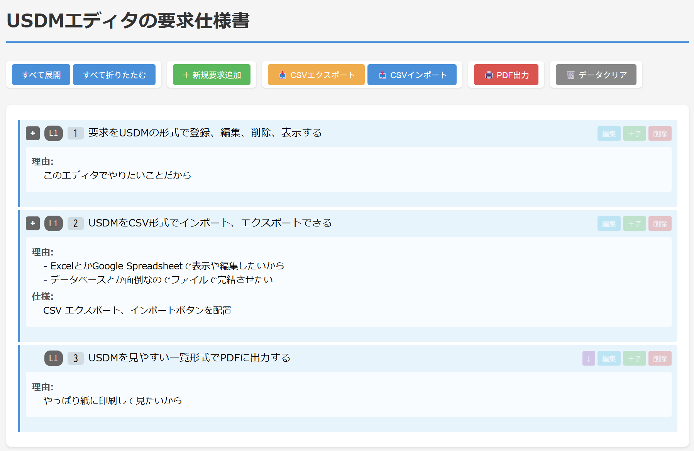
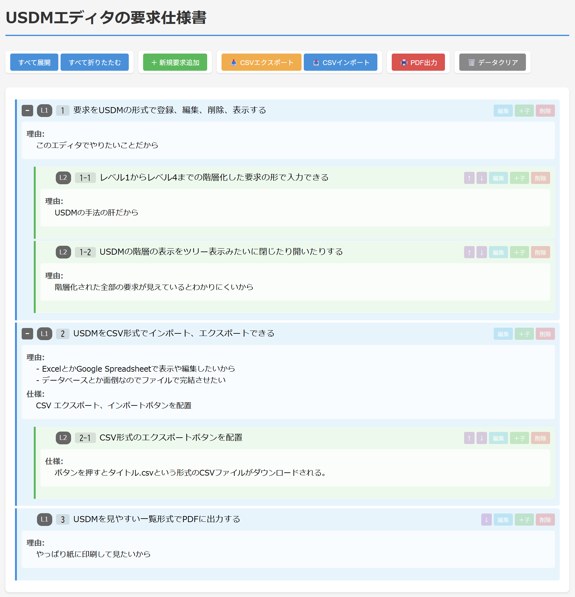

# USDM Editor - 要求仕様エディタ

USDM（Universal Specification Describing Manner）形式で要求仕様を階層的に管理・編集するChrome拡張機能です。

### スクリーンショット



## 機能

- **階層的な要求管理**: 最大4レベル（L1〜L4）の階層構造で要求を整理
- **要求・理由・仕様の管理**: 各要求に対して理由と仕様を紐付けて管理
- **CSV入出力**: データのインポート・エクスポートに対応
- **PDF出力**: 印刷用のPDFを生成
- **自動保存**: データはブラウザに自動保存され、次回起動時に復元

## インストール方法

### 開発者モードでインストール

1. このリポジトリをダウンロードまたはクローン
2. Chromeで `chrome://extensions` を開く
3. 右上の「デベロッパーモード」をONにする
4. 「パッケージ化されていない拡張機能を読み込む」をクリック
5. `usdm_editor` フォルダを選択

### 使い方

1. Chromeツールバーの拡張機能アイコンをクリック
2. 新しいタブでUSDM Editorが開きます
3. 「＋ 新規要求追加」で要求を追加
4. 要求をクリックして展開/折りたたみ
5. 編集・削除・子要求の追加が可能

## CSVフォーマット

```csv
# ドキュメントタイトル
"レベル1 ID","レベル2 ID","レベル3 ID","レベル4 ID","要求","理由","仕様"
"1","","","","要求の説明","理由の説明","仕様の説明"
"1","1","","","子要求の説明","","" 
```

- `#` で始まる行はコメント行
- 最初のコメント行がドキュメントタイトルとして使用されます
- レベル2〜4のIDは、その階層がない場合は空欄

## 操作方法

| 操作 | 説明 |
|------|------|
| すべて展開 | 全ての階層を展開表示 |
| すべて折りたたむ | 全ての階層を折りたたみ |
| ＋ 新規要求追加 | ルートレベル(L1)の要求を追加 |
| ＋子 | 選択した要求の子要求を追加 |
| 編集 | 要求の内容を編集 |
| 削除 | 要求を削除（子要求も含む） |
| ↑ | 要求のレベルを上げる |
| ↓ | 要求のレベルを下げる |
| CSVエクスポート | データをCSVファイルとして保存 |
| CSVインポート | CSVファイルからデータを読み込み |
| PDF出力 | 印刷用PDFを生成 |
| タイトルダブルクリック | ドキュメントタイトルを編集 |

## ライセンス

Apache 2.0 License

## バージョン履歴

### v1.0.0
- 初回リリース
- 階層的な要求管理機能
- CSV入出力機能
- PDF出力機能
- Chrome Storage によるデータ永続化
